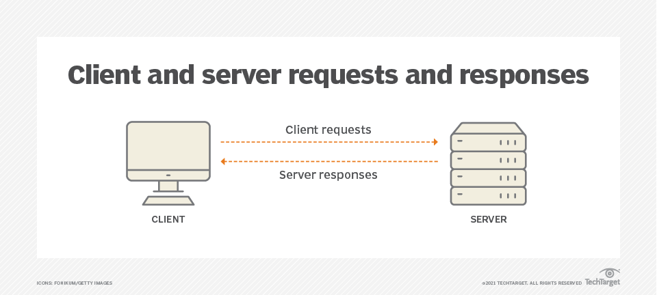

# Understanding API Basics: A Beginner's Guide to Working with APIs

*Posted on [09/05/2024] by Phillip Green*

Welcome back to The Green Stack! Today, we're diving into the world of APIs (Application Programming Interfaces). If you've ever wondered how different software applications communicate with each other, or how to integrate external services into your own projects, this guide is for you.

## Table of Contents
- [What is an API?](#what-is-an-api)
- [Types of APIs](#types-of-apis)
- [How APIs Work](#how-apis-work)
- [Making API Requests](#making-api-requests)
- [Understanding API Documentation](#understanding-api-documentation)
- [API Authentication](#api-authentication)
- [Common API Formats](#common-api-formats)
- [Integrating APIs into Your Projects](#integrating-apis-into-your-projects)
- [Best Practices for Working with APIs](#best-practices-for-working-with-apis)
- [Conclusion](#conclusion)

## What is an API?

An API (Application Programming Interface) is a set of protocols, routines, and tools for building software applications. It specifies how software components should interact, allowing different applications to communicate with each other.

Think of an API as a waiter in a restaurant:
- You (the client) don't go directly to the kitchen (the server).
- Instead, you give your order to the waiter (the API).
- The waiter takes your request to the kitchen and brings back what you ordered.

## Types of APIs

1. **Web APIs**: Accessed over the internet using HTTP protocols.
2. **Library-based APIs**: Provided by software libraries.
3. **Operating System APIs**: Allow applications to use OS features.
4. **Database APIs**: Enable communication with database management systems.

## How APIs Work

APIs typically follow a request-response cycle:

1. The client sends a request to the API endpoint.
2. The server receives and processes the request.
3. The server sends back a response with the requested data or an error message.
4. The client receives and processes the response.



## Making API Requests

Here's how to make a simple API request using different tools:

### Using cURL

```bash
curl https://api.openweathermap.org/data/2.5/weather?q=London&appid=YOUR_API_KEY
```

### Using Python with the requests library

```python
import requests

response = requests.get('https://api.openweathermap.org/data/2.5/weather?q=London&appid=YOUR_API_KEY')
data = response.json()
print(data)
```

### Using JavaScript with fetch

```javascript
fetch('https://api.openweathermap.org/data/2.5/weather?q=London&appid=YOUR_API_KEY')
  .then(response => response.json())
  .then(data => console.log(data))
  .catch(error => console.error('Error:', error));
```

## Understanding API Documentation

API documentation is crucial for understanding how to use an API. Look for these key elements:
- **Endpoints**
- **Methods** (GET, POST, PUT, DELETE, etc.)
- **Parameters**
- **Response Format**
- **Authentication**
- **Rate Limits**

## API Authentication

Many APIs require authentication. Common methods:
- **API Keys**
- **OAuth**
- **JWT**

### Example: Using an API Key in the Header

```bash
curl -H "Authorization: Bearer YOUR_API_KEY" https://api.example.com/data
```

```python
headers = {
    'Authorization': 'Bearer YOUR_API_KEY'
}
response = requests.get('https://api.example.com/data', headers=headers)
```

## Common API Formats

1. **JSON** (JavaScript Object Notation)
2. **XML** (eXtensible Markup Language)
3. **YAML** (YAML Ain't Markup Language)

## Best Practices for Working with APIs

- **Read the Documentation**.
- **Handle Errors Gracefully**.
- **Respect Rate Limits**.
- **Secure Your API Keys**.
- **Cache Responses**.
- **Use HTTPS**.

## Conclusion

APIs are powerful tools that allow developers to extend the functionality of their applications and integrate with external services. By understanding the basics of how APIs work and following best practices, you can effectively leverage these tools in your projects.

In our next post, we'll explore "Mastering the Command Line: Essential Commands for New Developers". Stay tuned, and happy coding!

*Got questions or suggestions? Feel free to open an issue or contribute to The Green Stack. Your input helps this garden of knowledge grow!*
